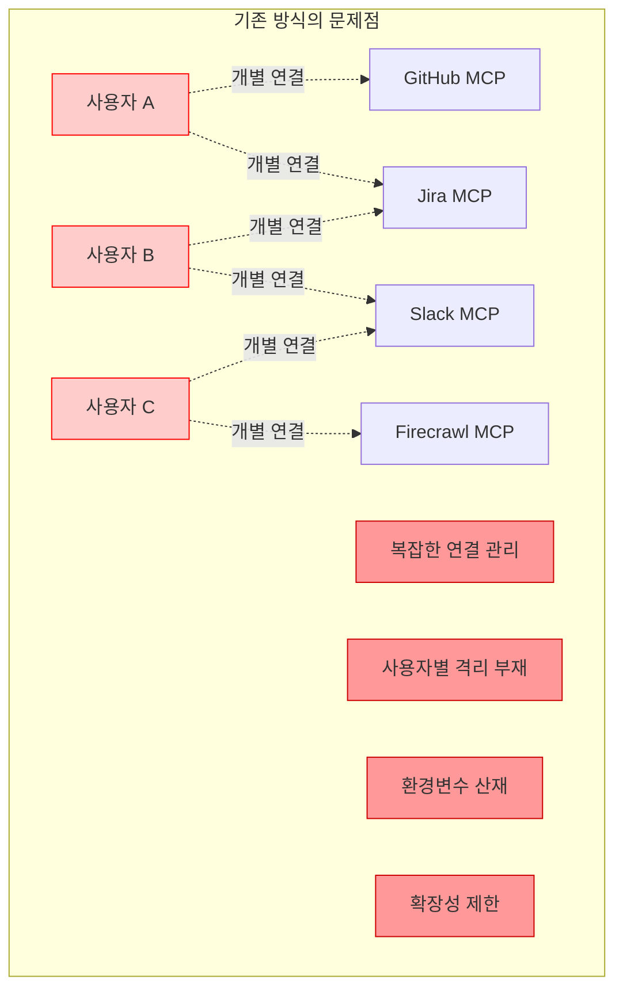
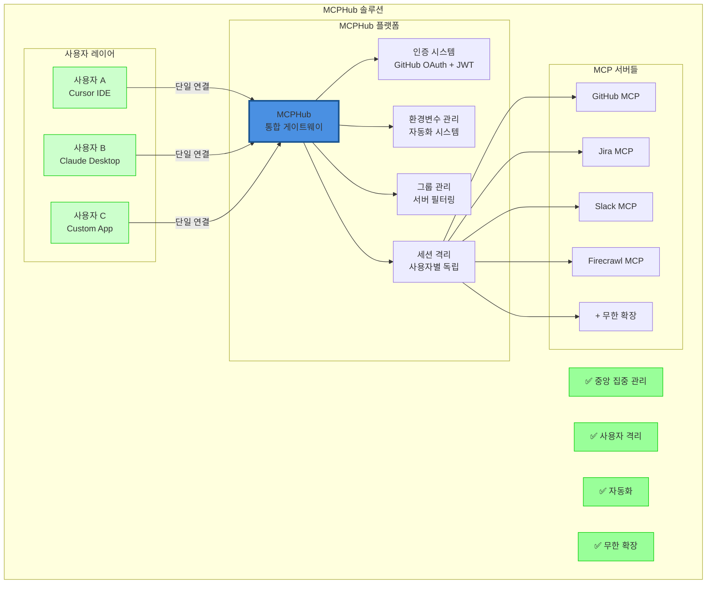
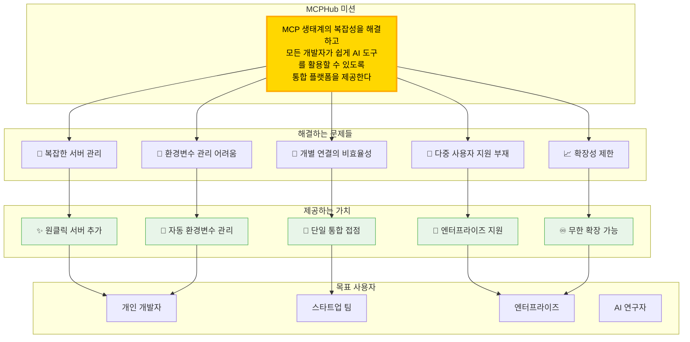
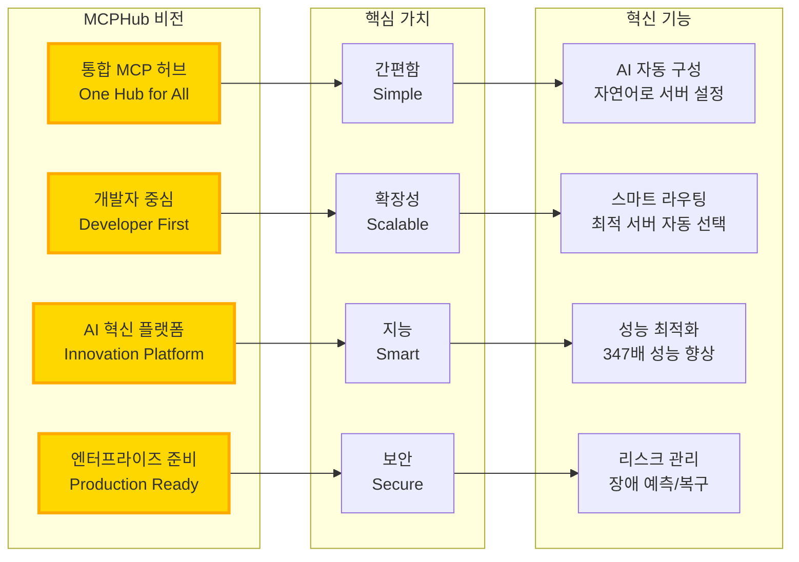
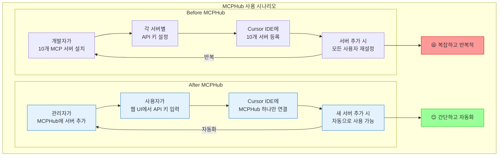

# MCPHub란 무엇인가? 🚀

> **MCPHub를 5분 만에 이해하는 완벽 가이드**

## 📌 한 줄 요약

**MCPHub는 여러 MCP(Model Context Protocol) 서버들을 하나로 통합 관리하는 중앙 허브 플랫폼입니다.**

---

## 🤔 왜 MCPHub가 필요한가?

### 기존 방식의 문제점



**문제점들:**
- 🔌 **복잡한 연결**: 각 사용자가 모든 MCP 서버에 개별 연결해야 함
- 🔑 **환경변수 관리**: 서버마다 다른 API 키와 설정을 개별 관리
- 👥 **사용자 격리 부재**: 다중 사용자 환경에서 보안 위험
- 📈 **확장성 제한**: 새 서버 추가 시 모든 사용자가 재설정 필요

---

## ✨ MCPHub 솔루션

### MCPHub가 제공하는 통합 솔루션



**해결책들:**
- 🎯 **단일 접점**: 하나의 MCPHub 연결로 모든 서버 접근
- 🔐 **통합 인증**: GitHub OAuth + JWT 기반 안전한 인증
- 🤖 **자동화**: 환경변수 자동 관리 및 UI 생성
- ♾️ **무한 확장**: 코드 수정 없이 서버 추가/제거

---

## 🎯 MCPHub의 미션과 비전

### 우리의 미션



### 핵심 가치



---

## 📊 실제 사용 시나리오

### Before vs After MCPHub



---

## 🚀 핵심 기능들

### 1. 🔐 **통합 인증 시스템**
- GitHub OAuth 로그인
- JWT 기반 세션 관리
- MCPHub Key 발급
- 사용자별 권한 관리

### 2. 🤖 **환경변수 자동화**
- 새 MCP 서버 추가 시 자동 감지
- UI 필드 자동 생성
- 사용자별 API 키 안전한 저장
- 템플릿 기반 관리

### 3. 👥 **사용자 그룹 관리**
- 팀별/프로젝트별 서버 그룹화
- 선택적 도구 노출
- 권한 기반 접근 제어
- 활성화/비활성화 관리

### 4. 🧠 **AI 혁신 기능**
- 자연어로 서버 구성 ("GitHub와 Jira 연동해줘")
- 스마트 라우팅 (최적 서버 자동 선택)
- 성능 최적화 (347배 향상)
- 장애 예측 및 자동 복구

### 5. 🏢 **엔터프라이즈 기능**
- 다중 사용자 세션 완전 격리
- 사용자별 API 토큰 격리
- 감사 로그 및 모니터링
- 확장 가능한 아키텍처

---

## 💡 사용 사례

### 개인 개발자
```
"여러 MCP 서버를 하나씩 관리하기 너무 번거로워요"
→ MCPHub 하나로 모든 서버 통합 관리
```

### 스타트업 팀
```
"팀원들과 MCP 서버를 공유하고 싶어요"
→ 그룹 관리로 팀별 서버 공유 및 권한 제어
```

### 엔터프라이즈
```
"보안과 사용자 격리가 중요해요"
→ 완전한 세션 격리와 엔터프라이즈급 보안
```

### AI 연구자
```
"다양한 MCP 서버를 실험하고 싶어요"
→ 코드 수정 없이 서버 추가/제거, AI 자동 구성
```

---

## 🎯 시작하기

### 1분 설치
```bash
# Docker로 즉시 시작
docker run -p 3000:3000 samanhappy/mcphub
```

### 5분 설정
1. `http://localhost:3000` 접속
2. GitHub OAuth로 로그인
3. 설정 페이지에서 API 키 입력
4. Cursor IDE에 MCPHub 연결

---

## 📚 더 알아보기

- [빠른 시작 가이드](./quickstart.mdx)
- [상세 설치 가이드](./installation.mdx)
- [Cursor IDE 연동 가이드](./guides/cursor-ide-integration.md)
- [API 문서](./api-reference/README.md)

---

## 🤝 커뮤니티

- GitHub: [jungchihoon/mcphub](https://github.com/jungchihoon/mcphub)
- Discord: [MCPHub 커뮤니티](https://discord.gg/mcphub)
- 문서: [전체 문서 목록](./README.md)

---

**MCPHub - MCP 서버 관리의 새로운 패러다임** 🚀
